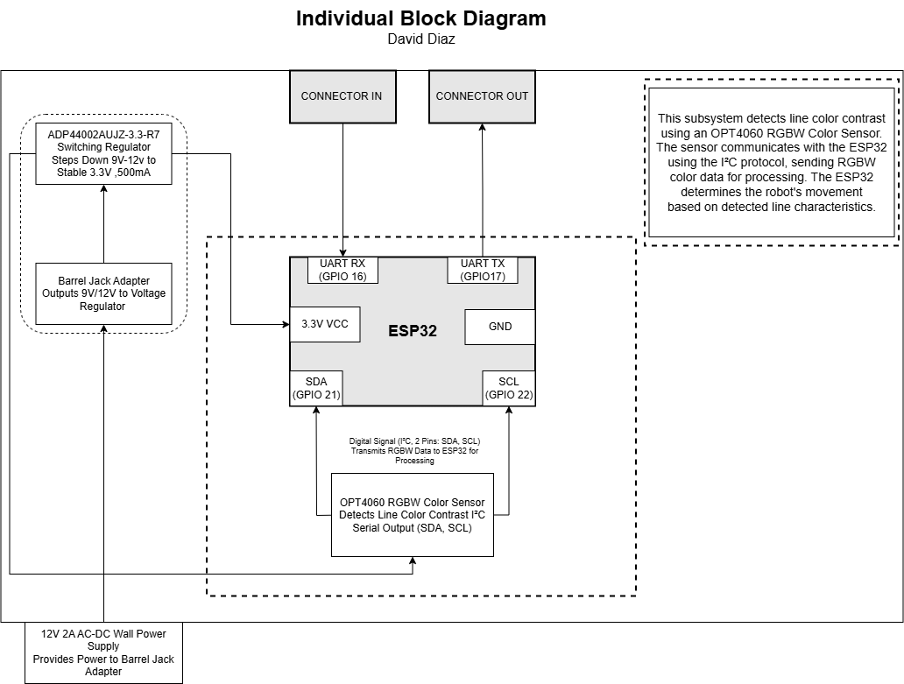

## Block Diagram

### Design Explanation

The block diagram was designed to clearly represent the signal and power flow within the Sensor Subsystem. The ESP32-S3 is placed at the center as the core processor, with the OPT4060 sensor connected to its I²C interface using IO18 (SCL) and IO19 (SDA). This placement reflects the logical data flow from sensor input to microcontroller processing. Voltage regulators are shown supplying stable 5V and 3.3V to their respective components to highlight the power architecture.

The layout was intentionally kept clean and modular to match the physical design on the PCB and make it easier to troubleshoot, test, and expand. By aligning the diagram with actual pin connections and subsystem boundaries, it provided a reliable blueprint for schematic and firmware development.

### Requirements Alignment

This block diagram meets the project’s functional and performance requirements by ensuring all essential communication and power lines are accounted for and logically organized. It visually confirms how sensor data is gathered, processed, and transmitted in real-time, supporting the robot's line-following capabilities. The I²C and UART pathways are explicitly shown, reinforcing protocol compliance and inter-subsystem integration. This structure enabled smooth implementation of firmware and accurate wiring in the final hardware.
