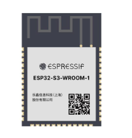
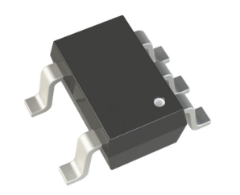
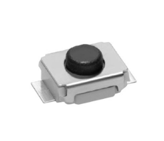
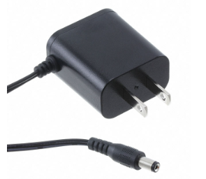
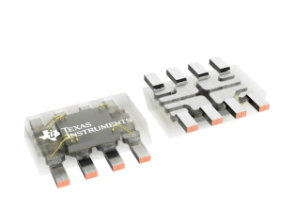
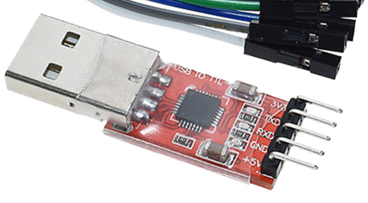
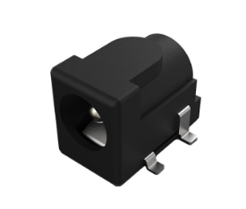
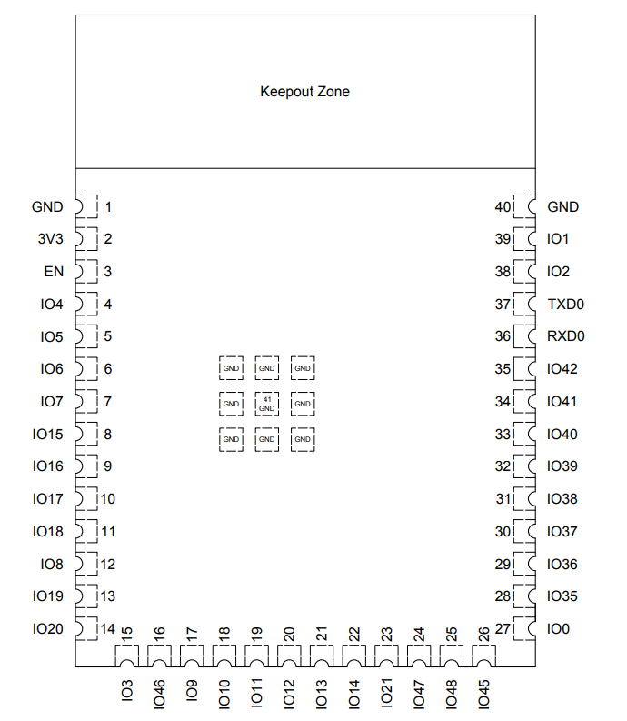

# Component Selection for Sensor Subsystem  
### David Diaz  
### EGR 314 - Sensor Subsystem  

## Introduction
The sensor subsystem of the line-following robot detects and interprets the path, allowing precise navigation. It includes a color sensor to read contrast and an ESP32-S3 microcontroller to process data and control movement.

This document outlines the selection of key components based on performance, compatibility, and integration, ensuring efficient operation and seamless communication within the system.

## **Project Components Overview**

| **Microcontroller** | **Voltage Regulator** | **Switch** | **Power Supply** | **Color Sensor** | **USB Connector** | **Barrel Jack** |
|--------------------|----------------------|------------|------------------|------------------|------------------|---------------|
|  |  |  |  |  |  |  |

## Major Components

| **Component Type** | **Component Name** | **Function in the System** |
|--------------------|--------------------|---------------------------|
| **Color Sensor** | OPT4060 RGBW | Detects line contrast and sends data via I2C | 
| **Microcontroller** | ESP32-S3-WROOM-1-N4 | Processes sensor data, controls robot functions |
| **Voltage Regulator** | LM2575D2T-3.3R4G | Steps down 12V to 3.3V to power ESP32 and sensor |
| **Power Supply** | 12V AC-DC Adapter | Provides power to the voltage regulator |
| **USB-to-Serial Adapter** | USB3131-30-0230-A | Required for programming ESP32-S3 via USB |
| **Push Button (RESET)** | Omron B3U Series (SMT) | Connects EN (RESET) to GND to restart ESP32 |
| **Push Button (BOOT Mode)** | Omron B3U Series (SMT) | Connects GPIO0 to GND to enter boot mode |
| **Switch (Enable ON/OFF)** | Omron B3U Series (SMT) | Controls the EN pin to turn the regulator ON/OFF |

---

## Component Comparison & Justification
| **Component Type**  | **Option**                     | **Pros**                                                              | **Cons**                                                                |
|--------------------|--------------------------------|----------------------------------------------------------------------|------------------------------------------------------------------------|
| **Microcontroller** | **ESP32-S3-WROOM-1-N4** (Chosen) | Powerful dual-core, WiFi & Bluetooth, SMD, multiple GPIO & I2C      | Requires external USB-UART adapter for flashing                        |
|                     | ESP8266                       | Cheaper, WiFi-enabled, good for basic IoT                           | Less RAM, fewer peripherals, no Bluetooth                             |
|                     | STM32F411CEU6                 | Powerful ARM Cortex-M4, many peripherals                            | No built-in WiFi/Bluetooth, requires external wireless module         |
| **Color Sensor**   | **OPT4060 RGBW** (Chosen)     | High-accuracy RGBW detection, I2C interface, compact SMD package     | More expensive than basic color sensors                                |
|                    | TCS34725 RGB Sensor           | Low cost, built-in IR blocking filter                                | Lower accuracy, larger footprint                                      |
|                    | AS7341 Spectral Sensor        | High precision with spectral channels                                | More complex to interface, higher power consumption                   |
| **Voltage Regulator** | **LM2575D2T-3.3R4G** (Chosen) | High efficiency, compact, low noise                                 | Requires external capacitors for stability                            |
|                    | AMS1117-3.3 LDO               | Simple, low cost, easy to use                                       | Less efficient (linear regulator), dissipates more heat               |
|                    | MP2315 Switching Regulator    | Higher efficiency, adjustable voltage output                         | Requires more external components, more complex circuit design        |

---

## Justification of Component Choices
Each of the above components was selected based on key factors such as electrical compatibility, ease of PCB integration, and availability.

### **1. Color Sensor - OPT4060 RGBW**
- Provides accurate RGBW color detection.
- Uses I2C communication, simplifying data transfer.
- Compact and reliable for high-speed line tracking.

- **Product Link:** [OPT4060 RGBW - DigiKey](https://www.digikey.lv/en/products/detail/texas-instruments/OPT4060DTSR/22116843)
- **Datasheet:** [OPT4060 RGBW Datasheet](https://www.ti.com/lit/ds/symlink/opt4060.pdf?ts=1704223000280)

---

### **2. Microcontroller - ESP32-S3-WROOM-1-N4**
- High-performance microcontroller with WiFi and Bluetooth capabilities.
- Supports multiple I2C and UART peripherals for sensor communication.
- Surface-mount package ensures compact PCB design.

- **Product Link:** [ESP32-S3-WROOM-1-N4 - DigiKey](https://www.digikey.com/en/products/detail/espressif-systems/ESP32-S3-WROOM-1-N4/16162639)
- **Datasheet:** [ESP32-S3-WROOM-1-N4 Datasheet](https://www.espressif.com/sites/default/files/documentation/esp32-s3-wroom-1_wroom-1u_datasheet_en.pdf)

---

### **3. Voltage Regulator - LM2575D2T-3.3R4G**
- Steps down 12V to 3.3V efficiently.
- Low noise and high power stability.
- Requires minimal external components for integration.

- **Product Link:**[LM2575D2T-3.3R4G - DigiKey](https://www.digikey.com/en/products/detail/onsemi/LM2575D2T-3-3R4G/1476688)
- **Datasheet:** (https://www.onsemi.com/pdf/datasheet/lm2575-d.pdf)

---

### **4. Power Supply - 12V AC-DC Adapter**
- Provides a stable 12V power source.
- Compatible with voltage regulator and ESP32 power requirements.

- **Product Link:** [Tri-Mag L6R06H-120 - DigiKey](https://www.digikey.lv/en/products/detail/tri-mag-llc/L6R06H-120/7682617)
- **Datasheet:** [Tri-Mag L6R06H-120 Datasheet](https://www.tri-mag.com/wp-content/uploads/2021/05/L6R06H_Series_2021-02a.pdf)

---

### **5. USB-to-Serial Adapter - USB3131-30-0230-A**
- Required for flashing firmware to the ESP32-S3.
- Provides stable USB-to-UART communication.

- **Product Link:** [USB3131-30-0230-A - DigiKey](https://www.digikey.com/en/products/detail/gct/USB3131-30-0230-A/9859642)
- **Datasheet:** [USB3131-30-0230-A Datasheet](https://gct.co/files/specs/usb3131-spec.pdf)
  

---

### **6. Surface-Mount Push Buttons - Omron B3U Series**
- Used for RESET and BOOT mode selection.
- Compact and easy to integrate into the PCB.
- Provides long operational life.

- **Product Link:** [Omron B3U-1000P - Mouser](https://www.mouser.com/ProductDetail/Omron-Electronics/B3U-1000P?qs=AO7BQMcsEu4ip80xyf2FwA%3D%3D&srsltid=AfmBOorCcS8cTuZ0dYUN8hCGonExu1E_8fJmpz2IEKzbWOCu_5lntN5z)
- **Datasheet:** [Omron B3U-1000P Datasheet](https://www.mouser.com/datasheet/2/307/en_b3u-3476507.pdf)

---

## **ESP32-S3-WROOM-1-N4 Component Specifications**   

| ESP Info                            | Answer                                          |
|-------------------------------------|------------------------------------------------|
| Model                               | ESP32-S3-WROOM-1-N4                           |
| Product Page URL                    | [Espressif Product Page](https://www.espressif.com/en/products/modules/esp32-s3-wroom-1) |
| ESP32-S3-WROOM-1-N4 Datasheet URL   | [Datasheet](https://www.espressif.com/documentation/esp32-s3-wroom-1_wroom-1u_datasheet_en.pdf) |
| ESP32 S3 Datasheet URL              | [ESP32-S3 Datasheet](https://espressif.com/documentation/esp32-s3_datasheet_en.pdf) |
| ESP32 S3 Technical Reference Manual URL | [Technical Manual](https://espressif.com/documentation/esp32-s3_technical_reference_manual_en.pdf) |
| Vendor link                         | [DigiKey](https://www.digikey.com/en/products/detail/espressif-systems/ESP32-S3-WROOM-1-N4/13632600) |
| Code Examples                       | [GitHub Libraries](https://github.com/espressif/esp-idf) |
| External Resources URL(s)           | [Google Search](https://www.google.com/search?q=ESP32-S3-WROOM-1-N4+tutorial) |
| Unit cost                           | $3.80 (DigiKey) |
| Absolute Maximum Current for entire IC | 500 mA |
| Supply Voltage Range                | Min: 3.0V / Nominal: 3.3V / Max: 3.6V |
| Maximum GPIO current (per pin)      | 40 mA |
| Supports External Interrupts?       | Yes |
| Required Programming Hardware, Cost, URL | CP2102 USB to UART ($6)  |

## **Peripheral Availability**  

| **Module**                          | **# Available** | **Needed** | **Associated Pins (or * for any)** |
|--------------------------------------|----------------|------------|------------------------------------|
| UART                                | 3            | 1          | TXD0, RXD0 |
| external SPI*                       | 2            | 1          | GPIO11, GPIO12, GPIO13, GPIO14 |
| I2C                                 | 2            | 1          | GPIO8 (SDA), GPIO9 (SCL) |
| GPIO                                | 36           | 4          | * |
| ADC                                 | 20           | 2          | GPIO1, GPIO2 |
| LED PWM                             | 8            | 2          | * |
| Motor PWM                           | 2            | 1          | * |
| USB Programmer                      | 1            | 1          | USB_D+, USB_D- |

---

## ESP32-S3-WROOM-1-N4 Pinout Diagram  

  

---

## Conclusion
This component selection ensures the sensor subsystem works reliably with the ESP32-S3, enabling precise color detection and stable power management. Each component was chosen for optimal performance, seamless integration, and efficient operation within the line-following robot.

---

